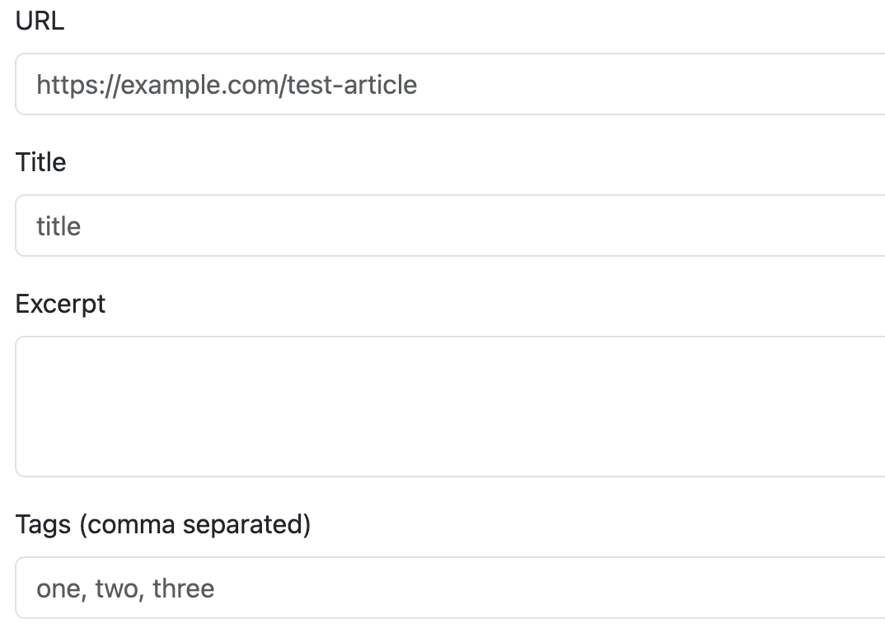
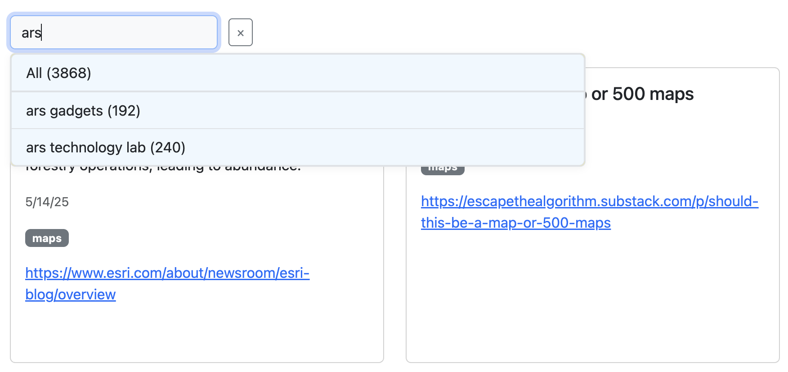

# DIY Pocket

After [Pocket shut down](https://support.mozilla.org/en-US/kb/future-of-pocket), I needed a new
way to save interesting content. 

Goals:

  - Avoid enshittification risk: own my data and rent low-level, durable infrastructure.
  - Store data in AWS: I have confidence that S3 and Lambda aren't going away soon.
  - Available with low latency on all of my devices.
  - Just for me: basic security best practices + obscurity is sufficient since this not sensitive data.

Components:

  - AWS Lambda function to save articles as a gzipped JSON file in S3
  - Alpine.js + bootstrap html page to display articles, hosted on S3

## AWS Lambda function: save article

An AWS Lambda function with a function URL accepts a POST request with:

```json
{
  "url": "article URL",
  "title": "article title",
  "source": "source name (optional)",
  "excerpt": "excerpt or summary",
  "tags": ["tag1", "tag2"],
  "photo_url": "photo URL (optional)"
}
```

The POST request saves the new article in a `pending-articles/` folder in S3.

A scheduled EventBridge rule triggers the Lambda function to update the file containing all articles:

  - load articles file from S3
  - load and merge all pending articles from `pending-articles/`
  - gzip and replace articles file in S3
  - delete the processed pending files


## Display & filter articles

A simple Alpine.js app loads a JSON file and displays it as Bootstrap cards, sorted  newest first. It also supports filterng articles by tag.

## Use cases

Save articles I click in my RSS feed, tagged with `rss`:

```
  const body = {
    url: story.find("a").attr("href"),
    title: story.find(".title").text().trim(),
    source: story.find(".source").text().trim(),
    excerpt: story.find(".summary").text().trim(),
    tags: ["rss"],
    photo_url: story.find("img").attr("src") || null,
  };

  $.post({
    url: config.webhookURL,
    data: JSON.stringify(body),
    contentType: "application/json",
    headers: {
      "x-auth-token": config.webhookToken,
    },
  });
```

Save articles I might want to find again:



View saved stories; filter by tag or search page text with find in page:



## Setup

### AWS

Create S3 bucket to store article JSON and serve static html page.

Create ECR repository to store container image for Lambda function.

Create AWS Lambda function:

  - from container image
  - using execution role with access to read and write S3 bucket
  - enable function URL
  - environment variables
    - BUCKET_NAME set to S3 bucket name
    - AUTH_TOKEN set to any string
  - Event Bridge trigger to update articles file on a schedule

### local

Create local.env with

```
FUNCTION_NAME=*lambda-function-name*
API_ENDPOINT=https://*value*.lambda-url.us-east-1.on.aws/save
ECR_REPO=*AWS account*.dkr.ecr.us-east-1.amazonaws.com/*ECR repo name**
AWS_ACCOUUNT_ID=*AWS account*
BUCKET=*S3 bucket name*
AUTH_TOKEN=*any string*
```

Install dependencies:

```
cd save && pip install -r requirements.txt
```

Build Docker image, push to ECR, and update Lambda function:

```
make login build update
```

Test:

```
python save/run_save.py
aws s3 cp s3://*S3 bucket name*/articles.json articles.json.gz
gzcat articles.json.gz | grep "Test Article Title"
```

Create display/config.js with

```
const DATA_URL = "https://*S3 bucket name*.s3.us-west-1.amazonaws.com/articles.json"
```

Deploy to S3 bucket:

```
make html
```

Test in browser:

```
https://*S3 bucket name*.s3.us-west-1.amazonaws.com/articles/index.html
```